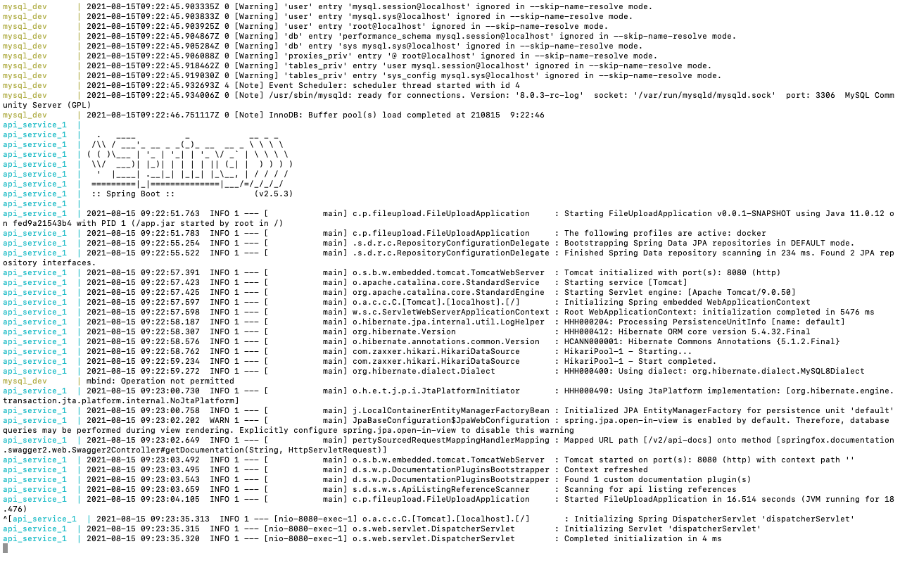
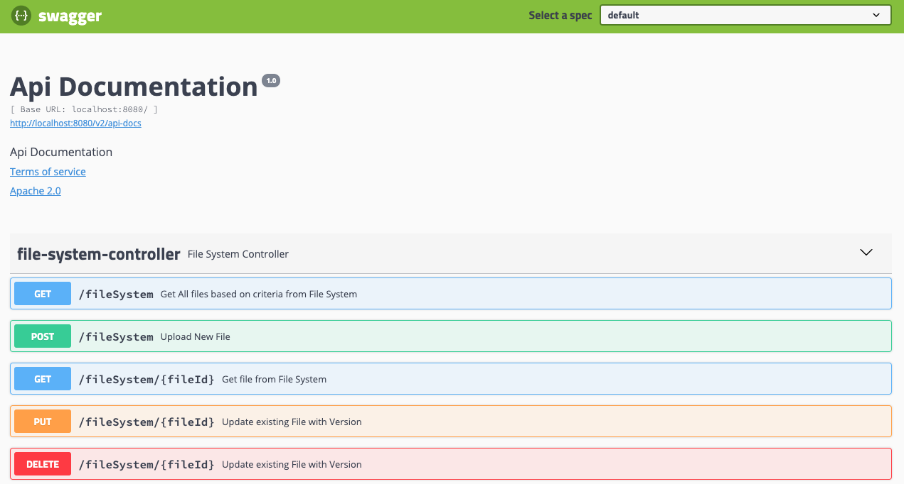

# File System Management with Versioning

# Introduction 

# Development Setup
● Install JDK 11+

● Install Maven

● Configure MySql properties in application-default.properties

● Use any IDE(Eclipse/IntelliJ) to setup workspace in local

# Commands to Run in Local
●  By Default Spring Profile is 'default', 

For any database changes in local setup, update application-default.properties.
**To Run the Application**

Goto Project base folder in Command Prompt/Terminal

..file-upload$

● Use Command "mvn clean install" to build the application

● To run the application in Command Prompt, use "mvnw spring-boot:run" which will build the application and run the application

● To run the application from build jar, use "java -jar target/file-upload-0.0.1-SNAPSHOT.jar"

NOTE: Make sure Database is created in mysql

# Commands to Run in Docker
**- Make sure Docker is configured and in running state**

● Use command "docker-compose build" to build the image.

● Use command "docker-compose up" to run the application.

Docker on running :

# Swagger Urls:

Swagger UI: http://localhost:8080/swagger-ui.html

Swagger JSON: http://localhost:8080/v2/api-docs

swagger-ui looks like this:

● To Get the File(s) from File Upload API

GET Method

http://localhost:8080/fileSystem?fileId=123&version=1

curl -X GET "http://localhost:8080/fileSystem?fileId=123&version=1" -H "accept: */*"

Parameters :    fileId [Optional]
                version [Optional]

This Resource is used to download the file(s).

If it has more than 1 record, it will download all the files as ZIP.

If file Not found, Response be like

{
"status": "ERROR",
"messages": {
"ERROR": [
"File(s) not found in File System"
]
},
"data": null
}

● To Upload a new File

http://localhost:8080/fileSystem

curl -X POST "http://localhost:8080/fileSystem" -H "accept: */*" -H "Content-Type: multipart/form-data" -F "file=@test.JPG;type=image/jpeg"

Parameters :    file [Required]

Sample Response:

Success:

{
"status": "SUCCESS",
"messages": null,
"data": {
"fileId": "6344944c-a64e-453f-a079-bbda4364c93d",
"version": 0,
"urls": {
"Get File": "http://localhost:8080/fileSystem/6344944c-a64e-453f-a079-bbda4364c93d"
},
"fileContentType": "image/jpeg"
}
}

Failed:

{
"status": "ERROR",
"messages": {
"ERROR": [
"File size exceed to max permitted size of file.",
"Maximum upload size exceeded; nested exception is java.lang.IllegalStateException: org.apache.tomcat.util.http.fileupload.impl.FileSizeLimitExceededException: The field file exceeds its maximum permitted size of 5242880 bytes."
]
},
"data": null
}

● To Update Existing file

PUT Method

http://localhost:8080/fileSystem/<pathVariable>?updateLatest=false

curl -X PUT "http://localhost:8080/fileSystem/6344944c-a64e-453f-a079-bbda4364c93d?updateLatest=false" -H "accept: */*" -H "Content-Type: multipart/form-data" -d {"file":{}}
Parameters :    file [Required]
                fileId [Required] as path Varaible
                updateLatest[Optional by default false], if we need to update existing without using version, make this as true.

Sample Response:

{
"status": "SUCCESS",
"messages": null,
"data": {
"fileId": "6344944c-a64e-453f-a079-bbda4364c93d",
"version": 1,
"urls": {
"Get File": "http://localhost:8080/fileSystem/6344944c-a64e-453f-a079-bbda4364c93d"
},
"fileContentType": "image/jpeg"
}
}

{
"status": "ERROR",
"messages": {
"ERROR": [
"File not found with fileId [6344944c-a64e-453f-a079-bbda4364c93]"
]
},
"data": null
}

● To Delete file

http://localhost:8080/fileSystem/<fileId>

curl -X DELETE "http://localhost:8080/fileSystem/6344944c-a64e-453f-a079-bbda4364c93" -H "accept: */*"

Sample Responses:

{
"status": "SUCCESS",
"messages": null,
"data": "Deleted fileId [6344944c-a64e-453f-a079-bbda4364c93d] Successfully of count [2]"
}

{
"status": "ERROR",
"messages": {
"ERROR": [
"File fileId [6344944c-a64e-453f-a079-bbda4364c93] not found/ deleted from File System"
]
},
"data": null
}

# Technical Stack
 
 **- Java JDK-11**

 **- Maven**

 **- Spring Boot - 2.5.3**

 **- Swagger - 2.9.2**
 
 **- Docker**
 
# Assumptions 
●	Lombok is install in IDE to avoid compilation errors.

